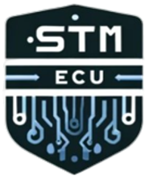
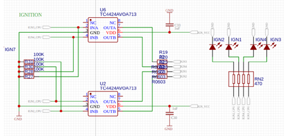
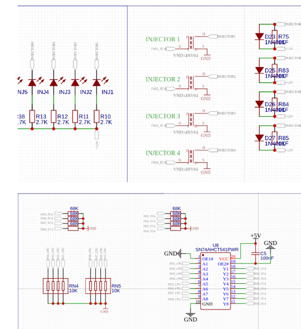
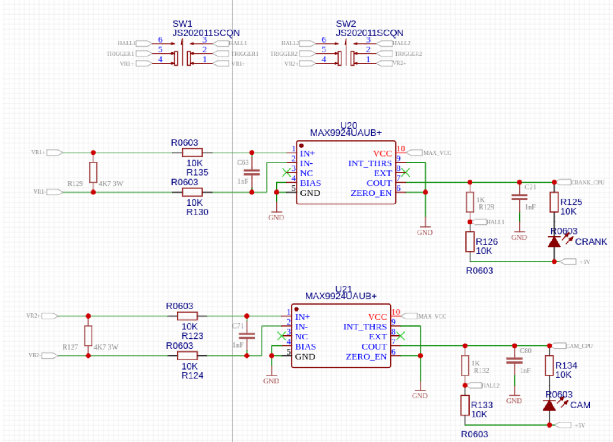
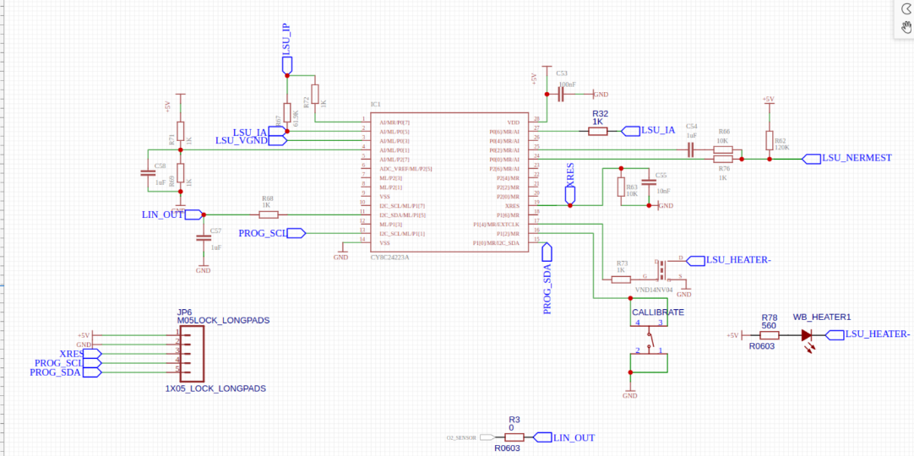

# SPEED TUNE MOTOR ECU

## Auteurs

- Alexandre MINGANT
- Bastien DELAUNAY

## Présentation

Ce projet vise à mettre en place une gestion moteur programmé sur carte électronique, communement appeler ECU (Electronic Control Unit ou Engine Control Unit), l'architecture moteur à gérer est un moteur thermique essence atmosphérique 4 temps, la carte électronique sera controler par un microcontroleur stm32. 

### Fonctionnement d'un moteur essence 4 temps
 
Il est important de rappeler le fonctionnement d'un moteur thermique essence à 4 temps:

chatgpt

[video]()

### Les périphériques moteurs

afin de pouvoir connaitre les paramètres optimales permettant une injection et un allumage optimale, résultant d'une combustion optimale, les moteurs sont équipées de divers périphériques, dont voici une liste des plus important avec leurs fonctions: 

- Sonde PMH (Point Mort Haut):
- Sonde lambda (Sonde O2):
- Sonde MAP (Manifold Air Pressure / Pression de l'air dans l'admission):
- Sonde TPS (Throttle Position Sensor):
- Sonde IAT (Intake Air Temperature):

et les 2 actionneurs:

- bobine d'allumage:
- Injecteur de carburant:

[video]()

### Objectifs du projet

Les objectifs visé pour ce projets sont réparties en 2 parties:

- Electronique :
  - Comprendre le fonctionnement des divers capteurs et leurs méthode d'acquisition de données et comprendre le fonctionnements des actionneurs. 
  - Concevoir une carte électronique ECU permettant la gestion des périphériques moteurs
  
- Programme : 
  - Concevoir un programme pour l'ECU permettant l'acquisition des données et la gestion des actionneurs sur base d'architecture stm32
  - Concevoir un programme de monitoring des données sur PC connecté en temps réel à l'ECU afin de collecter les données pertinantes et les analyser (dans le futur pouvoir modifier les données du calculateur).

### Structure du projet

définir la structure du git

## Partie électronique

La partie électronique de l'ECU constitue le cerveau du moteur, elle représente l'intelligence qui orchestre la performance optimale du moteur.

Elle est constitué de différents ensembles constitués d'éléments électroniques intelligents qui surveillent et contrôlent les différentes servitdes du moteur, comme la quantité d'essence qui entre dans le moteur ou la manière dont les étincelles sont produites pour allumer le carburant, par exemple. 

Les parties décrites ci-dessous permettent de de jeter un oeil à l'intérieur du système pour comprendre comment l'électronique de l'ECU est organisée pour rendre ainsi, le moteur aussi performant que possible.

### Les périphériques moteurs

(schema avec les capteurs/actionneurs)

### Microcontrolleur STM32F407VET6

Le STM32F407VET6 est un microcontrôleur 32 bits basé sur le cœur ARM Cortex-M4F. Il est fabriqué par STMicroelectronics et appartient à la famille STM32F407.

Cœur de processeur : ARM Cortex-M4F cadencé jusqu'à 168 MHz
Mémoire :
512 Ko de mémoire Flash
192 Ko de SRAM

### Gestion des bobines d'allumage

 Le processeur de l'ECU calcule le moment optimal d'allumage en fonction des données des capteurs. Il envoie ensuite un signal au TC4424AVOA713, qui agit comme un amplificateur de courant. Ce composant contrôle les MOSFETs, des interrupteurs électroniques, pour diriger le courant vers les bobines d'allumage au moment précis. Les bobines d'allumage créent des étincelles électriques, enflammant ainsi le mélange air-carburant dans les cylindres du moteur. 

 

### Gestion des injecteurs 

La configuration présentée ci-dessous est structurée autour des transistors MOSFET VND14NV04TR-E, utilisés pour réguler les injecteurs dans le calculateur moteur. La stratégie de contrôle du calculateur détermine le moment optimal pour l'injection, en prenant en compte divers paramètres tels que le régime moteur, la température et la charge d'admission.

L'électronique intégrée à l'injecteur est équipée de diodes assurant une protection contre les surtensions susceptibles de survenir au niveau des injecteurs.

L'alimentation électrique est fournie par une source de 12V, indispensable pour garantir un fonctionnement contrôlé et sécurisé du processus d'injection.

### Capteur Vilbrequin 

Le capteur de vilebrequin est conçu pour capturer un signal compris dans la plage de pulsations carrées de 0 à 5 volts. L'utilisation d'un capteur optoélectronique à effet Hall est indispensable pour répondre aux exigences d'acquisition de cette onde carrée numérique.

Pour acquérir le signal avec effet Hall, l'électronique de l'Unité de Commande du Moteur (ECU) doit être mise en œuvre par le biais d'une interface de capteur à résistance variable, équipée d'une entrée différentielle et d'un seuil de crête adaptatif. Dans notre cas, le MAX9924 a été employé pour cette fonction. Tout d'abord, il dispose d'une entrée compatible CMOS/TTL pour recevoir des signaux d'impulsions carrées provenant de capteurs tels que les capteurs à effet Hall. Le dispositif intègre un comparateur à hystérésis ajustable, permettant de définir précisément le seuil de détection.

Le MAX9924 est équipé d'un seuil de crête adaptable, ce qui signifie qu'il peut s'ajuster automatiquement en fonction des variations du signal d'entrée. Cela garantit une réponse robuste et adaptative aux changements de conditions environnementales ou de fonctionnement.

Lorsqu'un signal dépasse le seuil défini, le MAX9924 génère une sortie logique qui peut être utilisée pour déclencher des actions dans le système.

 
 

Ensemble Capteurs (Huile, Pression Essence, O2, accélérateur,liquide de refroidissement, température admission d’air, Capteur Barométrique et capteur MAP)

Les capteurs comprennent ceux de pression d'huile, de pression de carburant, d'oxygène, d'accélérateur, de liquide de refroidissement, de température d'admission d'air, de pression barométrique et de pression absolue du collecteur d'admission (MAP). Tous ces capteurs sont connectés aux entrées analogiques de notre microcontrôleur. En amont du microcontrôleur, des filtres passe-bas RC sont utilisés pour éliminer les fréquences parasites des signaux des capteurs. De plus, des ponts diviseurs sont placés en amont du microcontrôleur pour réduire la tension de 5V à 3,3V, assurant ainsi une acquisition précise et sécurisée des données pour le microcontrôleur STM32.

### Gestion de l'alimentation 

 

La gestion de l'alimentation de votre ECU implique un système d'alimentation double. Elle utilise une alimentation de 5V avec une sortie maximale de 3A, fournissant une puissance suffisante pour le fonctionnement global du système. De plus, une alimentation de 3,3V est utilisée, avec un courant maximal de 0,8A, spécifiquement adaptée au microcontrôleur STM32. Cette configuration à double tension assure une distribution d'énergie fiable et efficace, répondant aux exigences spécifiques à la fois de l'ECU dans son ensemble et du microcontrôleur STM32 qui le compose.

### Ensemble capteur sonde lambda 

 

La sonde lambda génère une tension analogique qui est proportionnelle à la concentration d'oxygène dans les gaz d'échappement. Le CY8C24223A est un convertisseur analogique-numérique (CAN) 12 bits qui peut être utilisé pour interfacer une sonde lambda. Le CAN convertit cette tension en un nombre numérique qui peut être utilisé par un microcontrôleur pour calculer le rapport air-carburant.

### Liaion CAN Bus 

Le CAN bus (Controller Area Network) est un réseau de communication série utilisé dans les applications automobiles et industrielles. Il permet aux différents calculateurs d'un véhicule ou d'une machine de communiquer entre eux. Le composant permettant la gestion de ce protocol est le SN65HVD230QDR.
Le SN65HVD230QDR est un transceiver CAN qui permet de convertir les signaux numériques du microcontrôleur en signaux différentiels compatibles avec le bus CAN. A ce stade, nous n'avons pas ecore établit ce type protocol de communication.

### Contrôle du convertisseur boost

Le VNLD5090-E est un driver de MOSFET 4 canaux qui permet de contrôler un convertisseur boost. Il possède 4 broches de sortie : BOOST, HC1, HC2 et IDLE.

BOOST : Cette broche permet de contrôler la tension de sortie du convertisseur boost.
HC1 et HC2 : Ces broches permettent de contrôler le courant de sortie du convertisseur boost.
IDLE : Cette broche permet de mettre le convertisseur boost en mode veille.

description des capteurs/actionneurs, fonctionnements et acquisition

### L'ECU (Engine Control Unit / Electronic Control Unit)

## Partie programme

intro

### Monitoring des données sur PC

### Gestion moteur sur ECU

## Etat du projet et suite

## Ressources
- Speeduino
- TunerStudio
- Megasquirt (check nom)
- Autres [ressources](/docs/autres/ressources.md)
