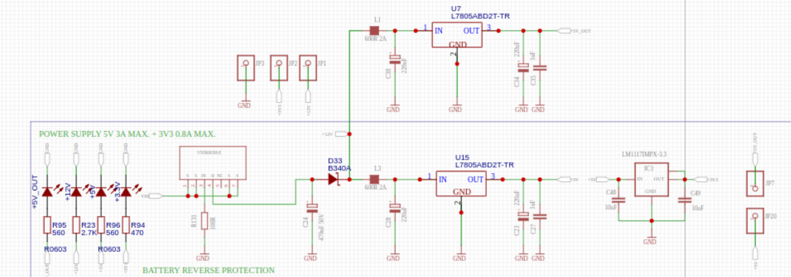

<center>

# SPEED TUNE MOTOR ECU


</center>

## Auteurs

- Alexandre MINGANT
- Bastien DELAUNAY

## Présentation

Ce projet vise à développer une gestion moteur programmée sur une carte électronique, également connue sous le nom d'ECU (Unité de Contrôle Électronique ou Engine Control Unit). L'objectif principal est d'optimiser le fonctionnement d'un moteur thermique essence atmosphérique à 4 temps. La carte électronique sera contrôlée par un microcontrôleur STM32.

L'ECU est un composant crucial dans un moteur moderne, chargé de surveiller et de contrôler divers aspects du fonctionnement du moteur en temps réel. Il reçoit des données provenant de capteurs tels que la sonde lambda, la sonde de température, la sonde de pression, etc., et utilise ces informations pour ajuster le mélange air-carburant, le moment de l'allumage, le régime moteur et d'autres paramètres afin d'optimiser les performances du moteur et de réduire les émissions polluantes.

Dans ce projet, l'ECU sera conçu pour interpréter les données des capteurs et prendre des décisions de contrôle en fonction d'un programme conçu au préalable. Le microcontrôleur STM32 offrira une plateforme robuste et flexible pour exécuter le code et gérer les interactions avec les différents composants du moteur.

En somme, ce projet vise à créer une solution de gestion moteur avancée et personnalisable, offrant des performances optimales et une efficacité accrue pour le moteur thermique à essence.

### Fonctionnement d'un moteur essence 4 temps
 
Voici une explication simplifiée du fonctionnement d'un moteur thermique à essence à 4 temps :

1. **Admission** : Le premier temps, appelé temps d'admission, commence avec l'aspiration d'un mélange air-carburant dans le cylindre lorsque le piston descend. La soupape d'admission s'ouvre et le mélange est aspiré dans le cylindre.

2. **Compression** : Pendant le temps de compression, le piston remonte et compresse le mélange air-carburant dans le cylindre. Les soupapes d'admission et d'échappement sont fermées pour éviter toute fuite de pression.

3. **Combustion** : L'étincelle produite par la bougie d'allumage déclenche la combustion du mélange air-carburant comprimé. Cette explosion pousse le piston vers le bas, ce qui génère de l'énergie mécanique.

4. **Échappement** : Enfin, lors du temps d'échappement, le piston remonte à nouveau et pousse les gaz brûlés hors du cylindre par la soupape d'échappement ouverte. Ce processus libère les gaz d'échappement et prépare le cylindre pour un nouveau cycle.

Ces quatre temps (admission, compression, combustion et échappement) constituent un cycle complet. Dans un moteur à plusieurs cylindres, ces cycles se produisent simultanément dans différents cylindres pour maintenir un fonctionnement fluide et fournir de la puissance constante.


Voici une animation complémentaire d'un [moteur essence 4 temps](https://www.youtube.com/watch?v=VP13eYbCtAc).

### Les périphériques moteurs

Pour garantir une injection et un allumage optimal, essentiels à une combustion efficace, les moteurs sont pourvus de divers périphériques. Voici une liste des plus importants, accompagnée de leurs fonctions :

- **Sonde PMH (Point Mort Haut)** : Cette sonde détecte la position du piston dans le cylindre, généralement utilisée pour synchroniser l'allumage et l'injection.

- **Sonde lambda (Sonde O2)** : Mesure la quantité d'oxygène dans les gaz d'échappement, permettant au système de contrôle du moteur de réguler le mélange air-carburant pour une combustion optimale.

- **Sonde MAP (Manifold Air Pressure / Pression de l'air dans l'admission)** : Mesure la pression de l'air entrant dans le collecteur d'admission, ce qui aide le calculateur du moteur à ajuster le débit de carburant en fonction de la charge du moteur.

- **Sonde TPS (Throttle Position Sensor)** : Surveille la position de la manette des gaz, permettant au calculateur de déterminer la demande de puissance du conducteur et d'ajuster en conséquence le mélange air-carburant.

- **Sonde IAT (Intake Air Temperature)** : Mesure la température de l'air entrant dans le moteur, aidant le calculateur à ajuster le mélange air-carburant en fonction des conditions ambiantes.

Explication en anglais de l'utilité et fonctionnement de chacuns de ces [capteurs](https://www.youtube.com/watch?v=dK4mb1yS0dY).

Et les 2 actionneurs :

- **Bobine d'allumage** : Transforme la basse tension de la batterie en haute tension nécessaire pour créer l'étincelle dans la chambre de combustion, déclenchant ainsi la combustion du mélange air-carburant.

- **Injecteur de carburant** : Vaporise le carburant dans la chambre de combustion, contrôlé par le calculateur moteur pour fournir la bonne quantité de carburant nécessaire à une combustion efficace.


### Objectifs du projet

Les objectifs de ce projet sont divisés en deux parties :

- Partie électronique :
  - Comprendre le fonctionnement des différents capteurs, leurs méthodes d'acquisition de données et le fonctionnement des actionneurs.
  - Concevoir une carte électronique ECU permettant de gérer les périphériques moteurs.

- Partie programmation :
  - Élaborer un programme pour l'ECU permettant d'acquérir des données et de gérer les actionneurs basé sur l'architecture STM32.
  - Développer un programme de surveillance des données sur un PC connecté en temps réel à l'ECU, permettant de collecter les données pertinentes et de les analyser (avec la capacité future de modifier les données du calculateur).


## Partie électronique

La partie électronique de l'ECU constitue le cerveau du moteur, elle représente l'intelligence qui orchestre la performance optimale du moteur.

Elle est constitué de différents ensembles constitués d'éléments électroniques intelligents qui surveillent et contrôlent les différentes servitdes du moteur, comme la quantité d'essence qui entre dans le moteur ou la manière dont les étincelles sont produites pour allumer le carburant, par exemple. 

Les parties décrites ci-dessous permettent de de jeter un oeil à l'intérieur du système pour comprendre comment l'électronique de l'ECU est organisée pour rendre ainsi, le moteur aussi performant que possible.


### Microcontrolleur STM32F407VET6

Le STM32F407VET6 est un microcontrôleur 32 bits basé sur le cœur ARM Cortex-M4F. Il est fabriqué par STMicroelectronics et appartient à la famille STM32F407.

Cœur de processeur : ARM Cortex-M4F cadencé jusqu'à 168 MHz
Mémoire :
512 Ko de mémoire Flash
192 Ko de SRAM

### Gestion des bobines d'allumage

 Le processeur de l'ECU calcule le moment optimal d'allumage en fonction des données des capteurs. Il envoie ensuite un signal au TC4424AVOA713, qui agit comme un amplificateur de courant. Ce composant contrôle les MOSFETs, des interrupteurs électroniques, pour diriger le courant vers les bobines d'allumage au moment précis. Les bobines d'allumage créent des étincelles électriques, enflammant ainsi le mélange air-carburant dans les cylindres du moteur. 

 

### Gestion des injecteurs 

La configuration présentée ci-dessous est structurée autour des transistors MOSFET VND14NV04TR-E, utilisés pour réguler les injecteurs dans le calculateur moteur. La stratégie de contrôle du calculateur détermine le moment optimal pour l'injection, en prenant en compte divers paramètres tels que le régime moteur, la température et la charge d'admission.

L'électronique intégrée à l'injecteur est équipée de diodes assurant une protection contre les surtensions susceptibles de survenir au niveau des injecteurs.

L'alimentation électrique est fournie par une source de 12V, indispensable pour garantir un fonctionnement contrôlé et sécurisé du processus d'injection.

 

### Capteur Vilbrequin 

Le capteur de vilebrequin est conçu pour capturer un signal compris dans la plage de pulsations carrées de 0 à 5 volts. L'utilisation d'un capteur optoélectronique à effet Hall est indispensable pour répondre aux exigences d'acquisition de cette onde carrée numérique.

Pour acquérir le signal avec effet Hall, l'électronique de l'Unité de Commande du Moteur (ECU) doit être mise en œuvre par le biais d'une interface de capteur à résistance variable, équipée d'une entrée différentielle et d'un seuil de crête adaptatif. Dans notre cas, le MAX9924 a été employé pour cette fonction. Tout d'abord, il dispose d'une entrée compatible CMOS/TTL pour recevoir des signaux d'impulsions carrées provenant de capteurs tels que les capteurs à effet Hall. Le dispositif intègre un comparateur à hystérésis ajustable, permettant de définir précisément le seuil de détection.

Le MAX9924 est équipé d'un seuil de crête adaptable, ce qui signifie qu'il peut s'ajuster automatiquement en fonction des variations du signal d'entrée. Cela garantit une réponse robuste et adaptative aux changements de conditions environnementales ou de fonctionnement.

Lorsqu'un signal dépasse le seuil défini, le MAX9924 génère une sortie logique qui peut être utilisée pour déclencher des actions dans le système.

 


### Ensemble Capteurs (Huile, Pression Essence, O2, accélérateur,liquide de refroidissement, température admission d’air, Capteur Barométrique et capteur MAP)

Les capteurs comprennent ceux de pression d'huile, de pression de carburant, d'oxygène, d'accélérateur, de liquide de refroidissement, de température d'admission d'air, de pression barométrique et de pression absolue du collecteur d'admission (MAP). Tous ces capteurs sont connectés aux entrées analogiques de notre microcontrôleur. En amont du microcontrôleur, des filtres passe-bas RC sont utilisés pour éliminer les fréquences parasites des signaux des capteurs. De plus, des ponts diviseurs sont placés en amont du microcontrôleur pour réduire la tension de 5V à 3,3V, assurant ainsi une acquisition précise et sécurisée des données pour le microcontrôleur STM32.

 

### Gestion de l'alimentation 


La gestion de l'alimentation de votre ECU implique un système d'alimentation double. Elle utilise une alimentation de 5V avec une sortie maximale de 3A, fournissant une puissance suffisante pour le fonctionnement global du système. De plus, une alimentation de 3,3V est utilisée, avec un courant maximal de 0,8A, spécifiquement adaptée au microcontrôleur STM32. Cette configuration à double tension assure une distribution d'énergie fiable et efficace, répondant aux exigences spécifiques à la fois de l'ECU dans son ensemble et du microcontrôleur STM32 qui le compose.

  

### Ensemble capteur sonde lambda 


La sonde lambda génère une tension analogique qui est proportionnelle à la concentration d'oxygène dans les gaz d'échappement. Le CY8C24223A est un convertisseur analogique-numérique (CAN) 12 bits qui peut être utilisé pour interfacer une sonde lambda. Le CAN convertit cette tension en un nombre numérique qui peut être utilisé par un microcontrôleur pour calculer le rapport air-carburant.

 

### Liaion CAN Bus 

Le CAN bus (Controller Area Network) est un réseau de communication série utilisé dans les applications automobiles et industrielles. Il permet aux différents calculateurs d'un véhicule ou d'une machine de communiquer entre eux. Le composant permettant la gestion de ce protocol est le SN65HVD230QDR.
Le SN65HVD230QDR est un transceiver CAN qui permet de convertir les signaux numériques du microcontrôleur en signaux différentiels compatibles avec le bus CAN. A ce stade, nous n'avons pas ecore établit ce type protocol de communication.


### Contrôle du convertisseur boost

Le VNLD5090-E est un driver de MOSFET 4 canaux qui permet de contrôler un convertisseur boost. Il possède 4 broches de sortie : BOOST, HC1, HC2 et IDLE.

BOOST : Cette broche permet de contrôler la tension de sortie du convertisseur boost.
HC1 et HC2 : Ces broches permettent de contrôler le courant de sortie du convertisseur boost.
IDLE : Cette broche permet de mettre le convertisseur boost en mode veille.


### L'ECU (Engine Control Unit / Electronic Control Unit)

La première étape de notre processus consistait à clarifier et définir les différents ensembles électroniques que nous devions mettre en œuvre. Pour s'assurer de la viabilité de nos conceptions, nous avons opté pour des simulations initiales à l'aide du logiciel LTSpice. Ces simulations nous ont permis d'analyser le comportement de nos schémas dans des conditions virtuelles, nous donnant ainsi des indications précieuses sur leur fonctionnement et leur conformité aux spécifications requises.

Suite à cette phase de simulation, une fois que nous avons confirmé la validité de nos conceptions, nous avons progressé vers l'étape suivante : le routage complet de la carte électronique. Cette tâche a été entreprise en utilisant le logiciel EasyEDA, qui offre des fonctionnalités avancées pour le dessin de circuits imprimés. Grâce à cet outil, nous avons pu traduire nos schémas en des dispositions physiques et interconnections sur la carte.


Nous avons par la suite passé commande du PCB de la carte, accompagné des composants déjà soudés. Pour ce faire, nous avons généré les fichiers Gerber ainsi que la liste des composants (BOM) à partir du logiciel EasyEDA. Ensuite, ces fichiers ont été transmis à JLCPCB pour la fabrication. Toutefois, certains composants n'étaient pas disponibles chez ce fournisseur, donc nous les avons achetés sur d'autres sites et procédé à leur soudage nous-mêmes.


Par la suite, une fois la phase de conception terminée, nous avons procédé aux premiers essais préliminaires de la carte électronique. Ces essais étaient cruciaux pour évaluer la fonctionnalité de notre système dans des conditions réelles. Pour ce faire, nous avons commencé par programmer un premier code dans le microcontrôleur STM32 à l'aide d'un STLink V2, permettant ainsi d'initialiser les différents composants et de mettre en place les premières fonctionnalités.

Ensuite, pour valider le bon fonctionnement de l'électronique associée aux capteurs et aux actionneurs, nous avons utilisé un multimètre et un oscilloscope.

v

## Partie Programme

Pour fonctionner, le projet a besoin de divers programmes, ceux-ci sont présentés et expliqués dans les parties qui suivent.

### Monitoring des données sur PC

Afin de pouvoir lire les données en temps réel de l'ECU depuis un PC, la mise en place d'un outil a été étudiée. Dans un premier temps, une analyse d'un projet existant nommé TunerStudio a été réalisée. Il s'agit d'un outil de monitoring avec une version gratuite qui possède une API pour communiquer et récolter les données d'un ECU, il est notamment utilisé pour le projet Speeduino ou encore Megasquirt.


Après analyse de la documentation de l'outil, il s'est avéré que sa mise en place est possible mais prendrait plus de temps que nécessaire pour notre projet. Suite à ces recherches, nous avons convenu de développer notre propre outil simplifié avec une interface graphique en Python. Le développement serait plus rapide avec nos connaissances et expériences avec ce langage ainsi que la mise en place d'application. Cette application utilise une architecture MVC.


Dans le contexte de l'architecture logicielle, MVC (Modèle - Contrôleur - Vue) est un pattern de conception qui divise une application en trois composants principaux pour améliorer la maintenabilité et la réutilisabilité du code. Le modèle représente les données de l'application et leur logique métier, le contrôleur agit comme un intermédiaire entre le modèle et la vue, gérant les interactions de l'utilisateur et mettant à jour le modèle en conséquence, tandis que la vue est responsable de l'affichage des données au travers de l'interface utilisateur. Ce modèle de conception favorise la séparation des préoccupations, ce qui facilite la modification et l'évolution de chaque composant indépendamment des autres, ce qui est essentiel dans le développement logiciel évolutif.


Comme présenté ci-dessus, notre outil de monitoring permettra d'afficher en temps réel diverses informations à l'aide de différents types d'afficheurs :

- Voyant clignotant pour les informations binaires.
- Compteur pour les informations analogiques.

Parmi les informations remontées et affichées, on retrouve :

- Ouverture du papillon d'admission d'air (plage : 0 - 100%).
- Vitesse moteur (0 - 8000 tr/min).
- Température de l'air à l'admission (-30 - 90 °C).
- Température du liquide de refroidissement (-30 - 150 °C).
- État des injecteurs (Inactif/Actif).
- État des bobines d'allumage (Inactif/Actif).

De plus, l'application possède une interface pour gérer la communication avec l'ECU :


Pour initialiser une communication, l'utilisateur doit sélectionner et renseigner certains paramètres :

- **Type de connexion** : Choix du type de communication avec l'ECU. À ce jour, seul le choix **UART** est disponible.
- **Paramètres de connexion**
  - **Port** : Choix du port de communication.
  - **Débit en bauds** : Choix de la vitesse de communication.

Une fois ces paramètres validés, l'utilisateur peut initier une tentative de connexion avec l'ECU en appuyant sur le bouton **Connect**. Si la connexion réussit, un message en dessous de la fenêtre affichera **Connected**, sinon **Not Connected**. Une fois connecté, l'utilisateur peut décider de stopper la communication à l'aide du bouton **Disconnect**.

L'ensemble des codes permettant le fonctionnement de l'application graphique est situé [ici](/software/GUI/).

Pour lancer l'interface, assurez-vous dans un premier temps d'avoir les bibliothèques nécessaires. Ensuite, via un terminal, placez-vous dans le répertoire [GUI](/software/GUI/) et exécutez :

```
python3 main.py
```

Suite à quoi, l'interface logicielle devrait s'ouvrir et l'utilisateur pourra utiliser l'application pour se connecter à un ECU et débuter le monitoring.

### Gestion moteur sur carte

Afin de gérer les différents périphériques disponibles (capteurs + actionneurs), nous devons réaliser un programme permettant leur contrôle, qui une fois écrit sera compilé puis envoyé dans la mémoire flash du microcontrôleur, nous permettant de gérer le moteur. Pour ce faire, une analyse de projets existants a été réalisée sur 2 projets similaires open-source :

- **MegaSquirt V2** : Il s'agit d'un système de gestion moteur open-source, conçu pour offrir un contrôle précis de l'injection de carburant et de l'allumage des moteurs. Avec sa conception modulaire et sa programmabilité étendue, il permet aux amateurs et aux professionnels de personnaliser les performances de leur moteur. MegaSquirt V2 est largement utilisé dans le monde du tuning automobile pour améliorer les performances et la fiabilité des moteurs, offrant une alternative abordable aux systèmes commerciaux propriétaires.

- **Speeduino** : Il s'agit d'un projet open-source offrant une solution abordable et modifiable pour la gestion moteur des voitures, permettant aux passionnés de tuning automobile de contrôler l'injection de carburant, l'allumage et d'autres paramètres moteur grâce à un ECU basé sur des composants électroniques facilement accessibles et personnalisables.

Le projet analysé MegaSquirt V2 étant plus ancien et moins documenté que Speeduino, l'analyse de Speeduino a été privilégiée. Le projet comporte plus de 88 fichiers de code et chaque fichier est plus ou moins conséquent (certains dépassent 1000 lignes de code + commentaires). Cette analyse prend du temps et à ce jour n'est pas terminée, cependant nous avons tout de même pu réaliser un schéma de l'architecture générale du code et son fonctionnement :


De plus, une structure de code a été choisie :
- Main : Déterminer les besoins du moteur et gérer l'allumage et l'injection.
- Globals : Définition des variables/fonctions utiles pour tous les modules.
- Inits : Initialisation des données et modules du calculateur.
- Sensors : Gestion de l'acquisition des données des capteurs.
- Decoders : Décodage des valeurs de certains capteurs.
- Comms : Gestion de la communication entre la carte et l'extérieur.
- Log : Archivage des activités (Optionnel).

Pour plus de détails, consultez [structure_code.md](/docs/autres/structure_code.md).

Pour des raisons de simplicité, l'écriture du code a débuté avec le fichier [globals.h](/software/carte/dev/inc/globals.h). En effet, ce fichier référence toutes les définitions, structures de données et variables qui sont globales au bon fonctionnement du programme principal (main.c) et des programmes annexes. Pour cette raison, il était plus intéressant de commencer la programmation par ce fichier.


La programmation et les essais de codes sont réalisés via l'IDE **STM32CubeIDE**. Il s'agit d'un environnement de développement puissant et convivial spécialement conçu pour simplifier le processus de développement d'applications embarquées pour les microcontrôleurs STM32. Il offre une combinaison d'outils avancés, de fonctionnalités de configuration et de débogage, ainsi qu'une prise en charge complète des microcontrôleurs STM32.


## Etat du projet et suite

### Partie Electronique

Pour garantir la compatibilité et la stabilité de l'interface nous devons réaliser des tests entre la carte et les servitudes, ainsi que pour assurer le bon fonctionnement du contrôle de l'asservissement. Pour ce faire, nous allons développer un banc de test numérique.

En parallèle, il est essentiel d'effectuer des tests en conditions réelles sur un moteur thermique afin de valider l'ECU. Cette démarche implique l'implémentation du calculateur sur un moteur thermique à quatre cylindres en utilisant un banc de test comme base. L'objectif est de vérifier l'efficacité opérationnelle du système et de s'assurer du contrôle adéquat du moteur.

### Partie Programme

Pour le **Monitoring des données**, le programme actuel n'est pas encore totalement opérationnel, quelques réglages restent à effectuer pour l'affichage et la récupération des données. Cependant, une décision a été prise concernant la possibilité de l'utilisation de TunerStudio. En effet, les fonctionnalités du logiciel sont plus complètes que notre application actuelle et il est utilisé sur des projets similaires. Cette solution a fait ses preuves et bénéficie d'un maintien dans le temps. Opter pour cette solution nous permettrait de réduire la charge de développement tout en garantissant un monitoring de qualité, ayant été pensé et revu au fil du temps.

Pour la **Gestion moteur**, l'analyse des codes de Speeduino est en cours et doit être poursuivie afin d'améliorer notre compréhension du système dans sa globalité. Cette démarche nous permettra ensuite de prendre les bonnes décisions pour le développement de notre propre code. De plus, cela nous aidera à éviter des erreurs basiques et nous permettra d'apprendre les bonnes méthodes et pratiques de programmation dans le domaine de l'embarqués grâce à la communauté open-source du projet. Après la programmation de notre code, des essais doivent être réalisés pour vérifier le bon fonctionnement de la carte et de son programme sur un banc d'essai. Enfin, le test final consistera à câbler notre ECU sur un vrai moteur et à vérifier le bon fonctionnement en surveillant son activité en situation réelle.


## Glossaire

- ECU = Engine Control Unit
- AFR = Air Fuel Ratio
- TPS = Throttle Position Sensor
- MAP = Manifold Air Pressure
- MAF = Manifold Air Field
- IAT = Intake Air Temperature

## Ressources
- [Speeduino](https://speeduino.com/home/)
- [TunerStudio](https://www.tunerstudio.com/)
- [Megasquirt](https://www.megasquirt.fr/)
- [Ressources complémentaire](/docs/autres/ressources.md)
