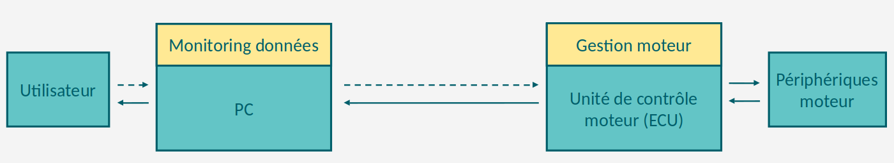
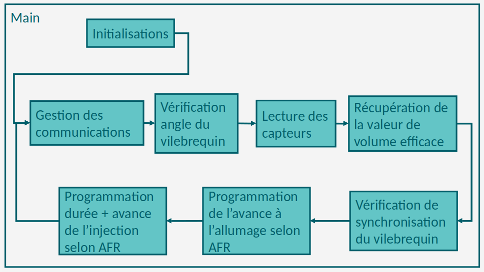

<center>

# SPEED TUNE MOTOR ECU


</center>

## Auteurs

- Alexandre MINGANT
- Bastien DELAUNAY

## Présentation

Ce projet vise à développer une gestion moteur programmée sur une carte électronique, également connue sous le nom d'ECU (Unité de Contrôle Électronique ou Engine Control Unit). L'objectif principal est d'optimiser le fonctionnement d'un moteur thermique essence atmosphérique à 4 temps. La carte électronique sera contrôlée par un microcontrôleur STM32.

L'ECU est un composant crucial dans un moteur moderne, chargé de surveiller et de contrôler divers aspects du fonctionnement du moteur en temps réel. Il reçoit des données provenant de capteurs tels que la sonde lambda, la sonde de température, la sonde de pression, etc., et utilise ces informations pour ajuster le mélange air-carburant, le moment de l'allumage, le régime moteur et d'autres paramètres afin d'optimiser les performances du moteur et de réduire les émissions polluantes.

Dans ce projet, l'ECU sera conçu pour interpréter les données des capteurs et prendre des décisions de contrôle en fonction d'un programme conçu au préalable. Le microcontrôleur STM32 offrira une plateforme robuste et flexible pour exécuter le code et gérer les interactions avec les différents composants du moteur.

En somme, ce projet vise à créer une solution de gestion moteur avancée et personnalisable, offrant des performances optimales et une efficacité accrue pour le moteur thermique à essence.

### Fonctionnement d'un moteur essence 4 temps
 
Voici une explication simplifiée du fonctionnement d'un moteur thermique à essence à 4 temps :

1. **Admission** : Le premier temps, appelé temps d'admission, commence avec l'aspiration d'un mélange air-carburant dans le cylindre lorsque le piston descend. La soupape d'admission s'ouvre et le mélange est aspiré dans le cylindre.

2. **Compression** : Pendant le temps de compression, le piston remonte et compresse le mélange air-carburant dans le cylindre. Les soupapes d'admission et d'échappement sont fermées pour éviter toute fuite de pression.

3. **Combustion** : L'étincelle produite par la bougie d'allumage déclenche la combustion du mélange air-carburant comprimé. Cette explosion pousse le piston vers le bas, ce qui génère de l'énergie mécanique.

4. **Échappement** : Enfin, lors du temps d'échappement, le piston remonte à nouveau et pousse les gaz brûlés hors du cylindre par la soupape d'échappement ouverte. Ce processus libère les gaz d'échappement et prépare le cylindre pour un nouveau cycle.

Ces quatre temps (admission, compression, combustion et échappement) constituent un cycle complet. Dans un moteur à plusieurs cylindres, ces cycles se produisent simultanément dans différents cylindres pour maintenir un fonctionnement fluide et fournir de la puissance constante.


Voici une animation complémentaire d'un [moteur essence 4 temps](https://www.youtube.com/watch?v=VP13eYbCtAc).

### Les périphériques moteurs

Pour garantir une injection et un allumage optimal, essentiels à une combustion efficace, les moteurs sont pourvus de divers périphériques. Voici une liste des plus importants, accompagnée de leurs fonctions :

- **Sonde PMH (Point Mort Haut)** : Cette sonde détecte la position du piston dans le cylindre, généralement utilisée pour synchroniser l'allumage et l'injection.

- **Sonde lambda (Sonde O2)** : Mesure la quantité d'oxygène dans les gaz d'échappement, permettant au système de contrôle du moteur de réguler le mélange air-carburant pour une combustion optimale.

- **Sonde MAP (Manifold Air Pressure / Pression de l'air dans l'admission)** : Mesure la pression de l'air entrant dans le collecteur d'admission, ce qui aide le calculateur du moteur à ajuster le débit de carburant en fonction de la charge du moteur.

- **Sonde TPS (Throttle Position Sensor)** : Surveille la position de la manette des gaz, permettant au calculateur de déterminer la demande de puissance du conducteur et d'ajuster en conséquence le mélange air-carburant.

- **Sonde IAT (Intake Air Temperature)** : Mesure la température de l'air entrant dans le moteur, aidant le calculateur à ajuster le mélange air-carburant en fonction des conditions ambiantes.

Explication en anglais de l'utilité et fonctionnement de chacuns de ces [capteurs](https://www.youtube.com/watch?v=dK4mb1yS0dY).

Et les 2 actionneurs :

- **Bobine d'allumage** : Transforme la basse tension de la batterie en haute tension nécessaire pour créer l'étincelle dans la chambre de combustion, déclenchant ainsi la combustion du mélange air-carburant.

- **Injecteur de carburant** : Vaporise le carburant dans la chambre de combustion, contrôlé par le calculateur moteur pour fournir la bonne quantité de carburant nécessaire à une combustion efficace.


### Objectifs du projet

Les objectifs de ce projet sont divisés en deux parties :

- Partie électronique :
  - Comprendre le fonctionnement des différents capteurs, leurs méthodes d'acquisition de données et le fonctionnement des actionneurs.
  - Concevoir une carte électronique ECU permettant de gérer les périphériques moteurs.

- Partie programmation :
  - Élaborer un programme pour l'ECU permettant d'acquérir des données et de gérer les actionneurs basé sur l'architecture STM32.
  - Développer un programme de surveillance des données sur un PC connecté en temps réel à l'ECU, permettant de collecter les données pertinentes et de les analyser (avec la capacité future de modifier les données du calculateur).



## Partie électronique

intro

### Les périphériques moteurs


(schema avec les capteurs/actionneurs)

description des capteurs/actionneurs, fonctionnements et acquisition

### L'ECU (Engine Control Unit / Electronic Control Unit)


## Partie Programme

Pour fonctionner, le projet a besoin de divers programmes, ceux-ci sont présentés et expliqués dans les parties qui suivent.

### Monitoring des données sur PC

Afin de pouvoir lire les données en temps réel de l'ECU depuis un PC, la mise en place d'un outil a été étudiée. Dans un premier temps, une analyse d'un projet existant nommé TunerStudio a été réalisée. Il s'agit d'un outil de monitoring avec une version gratuite qui possède une API pour communiquer et récolter les données d'un ECU, il est notamment utilisé pour le projet Speeduino ou encore Megasquirt.


Après analyse de la documentation de l'outil, il s'est avéré que sa mise en place est possible mais prendrait plus de temps que nécessaire pour notre projet. Suite à ces recherches, nous avons convenu de développer notre propre outil simplifié avec une interface graphique en Python. Le développement serait plus rapide avec nos connaissances et expériences avec ce langage ainsi que la mise en place d'application. Cette application utilise une architecture MVC.


Dans le contexte de l'architecture logicielle, MVC (Modèle - Contrôleur - Vue) est un pattern de conception qui divise une application en trois composants principaux pour améliorer la maintenabilité et la réutilisabilité du code. Le modèle représente les données de l'application et leur logique métier, le contrôleur agit comme un intermédiaire entre le modèle et la vue, gérant les interactions de l'utilisateur et mettant à jour le modèle en conséquence, tandis que la vue est responsable de l'affichage des données au travers de l'interface utilisateur. Ce modèle de conception favorise la séparation des préoccupations, ce qui facilite la modification et l'évolution de chaque composant indépendamment des autres, ce qui est essentiel dans le développement logiciel évolutif.


Comme présenté au-dessus, notre outils de monitoring permettra d'afficher en temps réels divers informations à l'aide de type d'afficheur:

- Voyant clignotant pour les informations binaires
- Compteur pour les informations analogiques

Parmis les informations remonté et affiché, on retrouve:

- Ouverture du papillon d'admision d'air (plage = 0 - 100%)
- Vitesse moteur (0 - 8000 tr/min)
- Température de l'air à l'admission (-30 - 90 °C)
- Température du liquide de reffroidissement (-30 - 150 °C)
- Etat des injecteurs (Inactif/Actif )
- Etat des bobines d'allumage (Inactif/Actif) 

De plus l'application possède une interface pour gérer la communication avec l'ECU:


Pour initiliser une communication, l'utilisateur doit sélectionner et renseigner certains paramètres:

- **Connection Type** : Choix du type de communication avec l'ECU, à ce jour seul le choix **UART** est disponible
- **Connection Settings**
  - **Port** : Choix du port de communication
  - **Baud rate**: Choix de la vitesse de communication

Une fois ces paramètres validé, l'utilisateur peut initier une tentative de connection avec l'ECU avec un appuie sur le bouton **Connect**, si la connection réussi, un message en dessous de la fenêtre affichera **Connected** sinon **Not Connected**, l'utilisateur une fois connecté peut décider de stopper la communication à l'aide du bouton **Disconnect**.

L'ensemble des codes permettant le fonctionnement de l'application graphique est situé [ici](/software/GUI/).

Pour lancer l'interface, assurez-vous dans un premier temps d'avoir les bibliothèques nécessaires. Ensuite, via un terminal, placez-vous dans le répertoire [GUI](/software/GUI/) et exécutez :

```
python3 main.py
```

Suite à quoi, l'interface logicielle devrait s'ouvrir et l'utilisateur pourra utiliser l'application pour se connecter à un ECU et débuter le monitoring.

### Gestion moteur sur carte

Afin de gérer les différents périphériques disponibles (capteurs + actionneurs), nous devons réaliser un programme permettant leur contrôle, qui une fois écrit sera compilé puis envoyé dans la mémoire flash du microcontrôleur, nous permettant de gérer le moteur. Pour ce faire, une analyse de projets existants a été réalisée sur 2 projets similaires open-source :

- **MegaSquirt V2** : Il s'agit d'un système de gestion moteur open-source, conçu pour offrir un contrôle précis de l'injection de carburant et de l'allumage des moteurs. Avec sa conception modulaire et sa programmabilité étendue, il permet aux amateurs et aux professionnels de personnaliser les performances de leur moteur. MegaSquirt V2 est largement utilisé dans le monde du tuning automobile pour améliorer les performances et la fiabilité des moteurs, offrant une alternative abordable aux systèmes commerciaux propriétaires.

- **Speeduino** : Il s'agit d'un projet open-source offrant une solution abordable et modifiable pour la gestion moteur des voitures, permettant aux passionnés de tuning automobile de contrôler l'injection de carburant, l'allumage et d'autres paramètres moteur grâce à un ECU basé sur des composants électroniques facilement accessibles et personnalisables.

Le projet analysé MegaSquirt V2 étant plus ancien et moins documenté que Speeduino, l'analyse de Speeduino a été privilégiée. Le projet comporte plus de 88 fichiers de code et chaque fichier est plus ou moins conséquent (certains dépassent 1000 lignes de code + commentaires). Cette analyse prend du temps et à ce jour n'est pas terminée, cependant nous avons tout de même pu réaliser un schéma de l'architecture générale du code et son fonctionnement :



De plus, une structure de code a été choisie :
- Main : Déterminer les besoins du moteur et gérer l'allumage et l'injection.
- Globals : Définition des variables/fonctions utiles pour tous les modules.
- Inits : Initialisation des données et modules du calculateur.
- Sensors : Gestion de l'acquisition des données des capteurs.
- Decoders : Décodage des valeurs de certains capteurs.
- Comms : Gestion de la communication entre la carte et l'extérieur.
- Log : Archivage des activités (Optionnel).

Pour plus de détails, consultez [structure_code.md](/docs/autres/structure_code.md).

Pour des raisons de simplicité, l'écriture du code a débuté avec le fichier [globals.h](/software/carte/dev/inc/globals.h). En effet, ce fichier référence toutes les définitions, structures de données et variables qui sont globales au bon fonctionnement du programme principal (main.c) et des programmes annexes. Pour cette raison, il était plus intéressant de commencer la programmation par ce fichier.

Description du code dans globals.h. **TODO**

La programmation et les essais de codes sont réalisés via l'IDE **STM32CubeIDE**. Il s'agit d'un environnement de développement puissant et convivial spécialement conçu pour simplifier le processus de développement d'applications embarquées pour les microcontrôleurs STM32. Il offre une combinaison d'outils avancés, de fonctionnalités de configuration et de débogage, ainsi qu'une prise en charge complète des microcontrôleurs STM32.


## Etat du projet et suite

## Glossaire

- AFR = Air Fuel Ratio
- TPS = Throttle Position Sensor
- MAP = Manifold Air Pressure
- MAF = Manifold Air Field
- IAT = Intake Air Temperature

## Ressources
- [Speeduino](https://speeduino.com/home/)
- [TunerStudio](https://www.tunerstudio.com/)
- [Megasquirt](https://www.megasquirt.fr/)
- [Ressources complémentaire](/docs/autres/ressources.md)